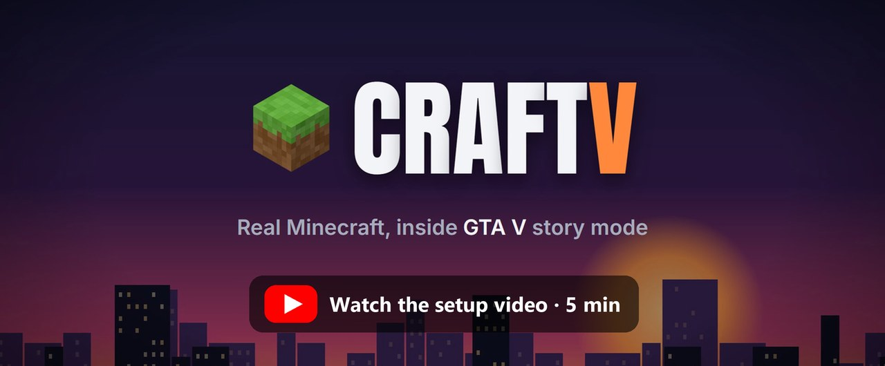

# CraftV

**Play Minecraft inside GTA V story mode, with your friends.**

You walk around Los Santos as Steve. You get Minecraft's hand, hotbar, hearts and hunger on top of GTA. You can
build on the streets, blow up cars with TNT and shoot people with a bow. Friends can join you from plain
Minecraft, or from their own GTA V, and you all see each other and everything you build.

[](https://www.youtube.com/watch?v=KuSXDtZwNgM&t=114s)

[](https://discord.gg/RN7e6Ya8Se)
Help, bug reports, clips and people to play with are on the [Discord server](https://discord.gg/RN7e6Ya8Se).

> [!WARNING]
> **Story mode only.** Never use mods in GTA Online. You can get your Rockstar account banned. CraftV turns
> itself off if it sees an online session, and Script Hook V closes the game if you go online.

> [!NOTE]
> **This is early access.** Some of what's listed here has only been tested without the game so far. The
> [Tested so far](#tested-so-far) section says which parts. If something doesn't work, please
> [open an issue](../../issues) or tell us on [Discord](https://discord.gg/RN7e6Ya8Se).

## Contents

- [What you can do](#what-you-can-do)
- [Tested so far](#tested-so-far)
- [What you need](#what-you-need)
- [Install](#install)
- [Play](#play)
- [Playing with friends](#playing-with-friends)
- [Settings](#settings)
- [Problems and fixes](#problems-and-fixes)
- [Uninstall](#uninstall)
- [Questions](#questions)
- [Known limitations](#known-limitations)
- [Building from source](#building-from-source)
- [Credits](#credits)

## What you can do

- **Become Steve.** Your Minecraft character takes the place of Franklin, Michael or Trevor. He sits in cars,
  and he holds up his arm when you use the phone.
- **Play survival.** You start with a kit: diamond sword, diamond pickaxe, bow and arrows, TNT, flint and steel,
  blocks, torches, food, redstone and a crafting table. Running uses up hunger and you eat with right click.
  If you get hurt in GTA you lose Minecraft hearts. If you die in Minecraft you get wasted in GTA.
- **Fight people and cars.** Hit someone in GTA with the sword and they get hurt and knocked back. Some run
  away and some fight back. Cars get dented too. The bow hits whatever your crosshair is on. TNT explodes in
  GTA, so cars blow up.
- **Use GTA's guns.** Your kit has GTA's guns as Minecraft items: pistol, SMG, assault rifle, shotgun, sniper
  rifle, RPG, minigun and grenades. Pick one in the hotbar and you're holding GTA's real gun. Steve aims it.
- **Build anywhere.** Put blocks on the street, on roofs, anywhere. They're solid in GTA: people and cars bump into
  them and you can stand on them. Torches light up the street at night.
- **Move like Minecraft.** Space does a straight jump up instead of GTA's jump, Ctrl crouches, and falls
  cost hearts once they're more than 3 blocks.
- **Play with friends.** A friend with plain Minecraft joins your world and walks around a blocky copy of
  Los Santos. A friend with their own GTA V and CraftV plays exactly like you, in the same world.
- **Change settings in game.** Press F8 for CraftV's menu. It looks like GTA's own menus. It also has
  creative mode, flying and a button that refills your kit.

## Tested so far

These have been tested in a real game (GTA V Legacy, build 3725):

- Minecraft drawn into GTA, with the hand, hotbar and HUD
- Placing blocks on GTA's streets
- Hitting people in GTA
- TNT blowing up in GTA
- A friend joining from plain Minecraft
- Copying GTA's ground into Minecraft

These have been tested only without GTA (automated tests, two copies of Minecraft on one PC, a fake GTA):

- Steve in cars, and the phone pose
- The Minecraft jump, crouching and fall damage
- GTA's guns as Minecraft items
- Creative mode, flying and refilling the kit
- GTA damage costing hearts, and getting wasted when you die in Minecraft
- TNT and arrows in GTA, and torch light
- Solid blocks
- The inventory
- The F8 menu
- A friend playing from their own GTA

## What you need

| What | Where to get it |
|---|---|
| Windows 10 or 11, and a PC that can run GTA V and Minecraft at the same time | |
| GTA V **Legacy** (not Enhanced), story mode | [Steam](https://store.steampowered.com/app/271590/), [Rockstar Games Launcher](https://www.rockstargames.com/gta-v) or [Epic Games Store](https://store.epicgames.com/p/grand-theft-auto-v) |
| Script Hook V | [dev-c.com/gtav/scripthookv](http://www.dev-c.com/gtav/scripthookv/) |
| ReShade, the version **with full add-on support** | [reshade.me](https://reshade.me) |
| Minecraft: Java Edition | [minecraft.net](https://www.minecraft.net/) |
| Fabric Loader for Minecraft 26.3 | [fabricmc.net/use/installer](https://fabricmc.net/use/installer/) |
| Fabric API 0.161.0+26.3 | [modrinth.com/mod/fabric-api](https://modrinth.com/mod/fabric-api/versions) |
| CraftV | [Releases](../../releases) on this page |

Only download these from the sites above. Mod files from random download sites can contain malware.

## Install

The whole install takes about 15 minutes. Do the three parts in order.

### Part 1: GTA V

1. Download **Script Hook V** from [dev-c.com](http://www.dev-c.com/gtav/scripthookv/). Open the zip, go
   into its `bin` folder, and copy `ScriptHookV.dll` and `dinput8.dll` into your GTA V folder (the folder that
   has `GTA5.exe` in it).
2. Download the latest **CraftV** zip from [Releases](../../releases) and unzip it somewhere.
3. Copy `CraftV.asi` and `CraftV.ini` from the CraftV zip into your GTA V folder.
4. Download **ReShade** from [reshade.me](https://reshade.me). Pick **"Download with full add-on support"**.
   CraftV doesn't work with the normal version.
5. Run the ReShade installer:
   - Pick `GTA5.exe`.
   - Pick **DirectX 10/11/12**.
   - When it asks about effect packages, untick all of them (CraftV brings its own) and finish.
6. In your GTA V folder, rename **`dxgi.dll`** to **`ReShade64.asi`**. GTA V doesn't load ReShade's `dxgi.dll`,
   but Script Hook V loads anything ending in `.asi`.
7. Open the `Minecraft view (ReShade)` folder in the CraftV zip. Copy everything inside it (`ReShade.ini`,
   `ReShadePreset.ini` and the `reshade-shaders` folder) into your GTA V folder. If Windows asks, replace the
   files.

### Part 2: Minecraft

CraftV needs its own copy of Minecraft running next to GTA. It uses your normal Minecraft account.

1. Download the **Fabric installer** from [fabricmc.net](https://fabricmc.net/use/installer/) and run it. Pick
   Minecraft **26.3** and click Install. This adds a `fabric-loader-26.3` installation to the Minecraft
   Launcher.
2. Open the Minecraft Launcher, go to **Installations**, hover over `fabric-loader-26.3` and click **Edit**.
   Under **Game directory**, pick a new empty folder, for example
   `C:\Users\YOUR-NAME\AppData\Roaming\.minecraft-craftv`, and click Save. This keeps CraftV's settings away from
   your normal Minecraft.
3. Download **Fabric API** for 26.3 from [Modrinth](https://modrinth.com/mod/fabric-api/versions) (version
   0.161.0+26.3).
4. In the game directory from step 2, make a folder called `mods`. Put the Fabric API file and
   `craftv-0.1.0.jar` (from the `Minecraft mod` folder in the CraftV zip) in it.

### Part 3: GTA settings

Start GTA V once, open **Settings > Graphics** and set:

- **Screen Type: Windowed Borderless**
- **Pause Game On Focus Loss: Off**

Turning **Depth of Field** off is also a good idea. GTA blurs its own picture, but not Minecraft's.

## Play

1. Open the Minecraft Launcher, pick **fabric-loader-26.3** and press Play. Minecraft opens a world called
   **CraftV** by itself. Leave that window open. The first time, Windows may ask whether Java can use the
   network: allow it on private networks so friends can join.
2. Start GTA V and load story mode.
3. The CraftV box in the top right says **MC view** when it's working.

| Key | What it does |
|---|---|
| Left mouse | Break blocks and hit. People in GTA get hurt and cars get dented |
| Right mouse | Place blocks, eat, use the bow, light TNT, flip levers |
| Mouse wheel or 1 to 9 | Pick a hotbar slot |
| E | Open Minecraft's inventory. Use the mouse in it. Esc closes it |
| Space | Minecraft jump |
| Ctrl | Crouch (sneak) |
| R | Reload, while holding one of the guns |
| F7 | Turn the Minecraft view on or off |
| F8 | CraftV settings |

Walking, driving and the camera are normal GTA controls. GTA's weapon wheel is off while the Minecraft view is
on: your weapons are in the hotbar. Pick a gun and GTA's aim and fire work (right mouse aims, left mouse shoots).
Pick the sword, the bow or TNT and the mouse does Minecraft things again.

## Playing with friends

Your Minecraft is the server. Your address is shown in GTA under **F8 > Friends join at**, for example
`192.168.1.23:25565`.

**Friends on the same Wi-Fi** can use that address as it is.

**Friends somewhere else** need you to open a port:

1. In your router's settings, forward **TCP port 25565** to your PC. Search "port forwarding" plus your router's
   name if you're not sure how.
2. Look up your public IP address (search "what is my IP").
3. Give your friend `YOUR-PUBLIC-IP:25565`. Only give it to people you trust.

**A friend with plain Minecraft 26.3** goes to Multiplayer > Direct Connect, types your address and joins. They
don't need anything else. They walk around a blocky copy of Los Santos, made from GTA's ground near you.

**A friend with their own GTA V** does all three install parts on their own PC. Before starting their Minecraft
for the first time, they copy the `config` folder from `Minecraft mod\For a friend` in the CraftV zip into their
game directory. Then they open `config\craftv.properties` in Notepad and put your address after `guest.join=`.
Their Minecraft then joins your world instead of making its own. Each of you sees the other as a Minecraft
character in your own GTA. Blocks either of you places show up for both and are solid for both.

Only Minecraft is shared. Each of you has your own GTA people, cars and police.

## Settings

Press **F8** in GTA. Use the arrow keys to move and change things. Backspace closes the menu. Everything is saved
in `CraftV.ini` next to `CraftV.asi`, so you can also change it there.

| Setting | Options | What it does |
|---|---|---|
| Minecraft view | On, Off | Minecraft drawn into GTA. F7 does the same |
| Creative mode | On, Off | Unlimited blocks, and you can't get hurt in Minecraft or GTA |
| Fly (experimental) | On, Off | Float around. Movement keys to fly, Space up, Ctrl down, Shift faster |
| Refill kit | | Tops up your kit, fills your hearts and hunger |
| Minecraft quality | Low, Medium, High, Very high, Max | How sharp Minecraft looks. Lower runs faster |
| Minecraft frame rate | 60, 90, 120, 144, Unlimited | Higher looks smoother when you turn the camera fast |
| Crosshair | On, Off | Minecraft's + in the middle of the screen, also in third person |
| Hand | On, Off | Your Minecraft hand and the item you hold, in first person |
| Block outlines | Off, Placed blocks, Everywhere | The box around the block you're looking at |
| Minecraft HUD | On, Off | The hotbar, hearts and hunger |
| Steve in cars | On, Off | Off shows GTA's own driver in cars |
| Jump | Minecraft, GTA | Minecraft jump or GTA's own jump and climbing |
| GTA damage | On, Off | Getting hurt in GTA costs hearts |
| TNT in GTA | On, Off | Minecraft explosions also happen in GTA |
| Arrows hurt people | On, Off | Minecraft arrows hit people in GTA |
| Torch light | On, Off | Torches light up GTA |
| Fall damage | On, Off | Falls cost hearts the Minecraft way |
| Inventory key | E, Tab, I | The key that opens the inventory |
| Hit strength | Weak, Normal, Strong, Brutal | How much your hits hurt people in GTA |
| Hide GTA HUD | On, Off | Hides GTA's minimap and HUD |
| CraftV overlay | Top right, Top left, Off | The small status box |
| Overlay details | On, Off | Extra numbers in the status box, for bug reports |
| Ground scanning | Smooth, Normal, Fast | How fast GTA's ground gets copied. Smooth costs the least FPS |
| Friends join at | | Your address for friends |

## Problems and fixes

| Problem | Fix |
|---|---|
| No CraftV box in GTA | Script Hook V isn't loaded. Check that `ScriptHookV.dll`, `dinput8.dll` and `CraftV.asi` are next to `GTA5.exe`, and that your Script Hook V version supports your GTA version |
| The box shows, but no Minecraft | Check that ReShade was renamed to `ReShade64.asi`, that you got the **add-on** version, and that Minecraft is running. Look in `ReShade.log` in the GTA folder for errors |
| The box says the link is red or yellow | Start the CraftV Minecraft first, wait for its world to load, then start GTA |
| Everything freezes when you click on another window | Set **Pause Game On Focus Loss** to **Off** in GTA's graphics settings |
| Low FPS | In F8, lower **Minecraft quality** and **Minecraft frame rate**, and set **Ground scanning** to Smooth |
| Steve smears when you turn | Raise **Minecraft frame rate** in F8 |
| Friends can't join | Check the address in F8, allow Java through Windows Firewall, and forward port 25565 for friends outside your Wi-Fi |
| Blocks inside a building land on the roof | Expected: CraftV copies GTA's ground from above. Build outside |
| Something else | Ask in [#craftv-help on Discord](https://discord.gg/RN7e6Ya8Se) or [open an issue](../../issues) with `CraftV.log` and `ReShade.log` (in the GTA folder) and `craftv-fabric.log` (in the `logs` folder of the CraftV game directory) |

## Uninstall

- **CraftV in GTA:** delete `CraftV.asi` and `CraftV.ini`.
- **ReShade:** delete `ReShade64.asi`, `ReShade.ini`, `ReShadePreset.ini` and the `reshade-shaders` folder.
- **Script Hook V:** delete `ScriptHookV.dll` and `dinput8.dll`.
- **CraftV in Minecraft:** delete the `fabric-loader-26.3` installation in the launcher, and its game directory.

## Questions

**Where can I get help?** On the [Discord server](https://discord.gg/RN7e6Ya8Se), in #craftv-help. Bring your
`CraftV.log` and `ReShade.log`.

**Can I use this in GTA Online?** No. Never. You can get banned.

**Does it work with GTA V Enhanced?** Not yet. Only Legacy has been tested.

**Do my friends need GTA V?** No. With plain Minecraft they join your world and walk around a blocky Los Santos.
With their own GTA V and CraftV, they get everything you get.

**Is my normal Minecraft affected?** No, as long as you gave the Fabric installation its own game directory.

**Can I use GTA's guns?** Yes. They're in your kit as Minecraft items. Pick one in the hotbar.

**What happens to my GTA health?** With GTA damage on, Minecraft's hearts decide. GTA's health is kept full,
and every hit in GTA costs hearts instead.

## Known limitations

- Only Minecraft is shared between friends. Each GTA has its own people, cars and traffic.
- GTA's ground is copied in whole blocks, so on hills Minecraft things can float or sink by up to half a block.
- Inside buildings and under bridges, the copied ground is the roof.
- At most 400 blocks near you are solid in GTA. GTA crashes if a mod makes too many objects.
- Running two games at once costs FPS.
- Friends playing plain Minecraft (without the CraftV mod) see CraftV's gun items as a purple and black block.

The full list is in [docs/KNOWN_LIMITATIONS.md](docs/KNOWN_LIMITATIONS.md).

## Building from source

You need Visual Studio 2022 with the C++ workload, JDK 25 (the Minecraft Launcher's Java 25 works), the
[Script Hook V SDK](http://www.dev-c.com/gtav/scripthookv/) in `sdk/ScriptHookV_SDK`, and
[ReShade's add-on headers](https://github.com/crosire/reshade) (v6.8.0, the `include` folder) in
`sdk/reshade-src`. Then run:

```powershell
.\scripts\build-native.ps1
cd fabric; .\gradlew build; cd ..
.\scripts\make-dist.ps1
```

More in [docs/DEVELOPMENT.md](docs/DEVELOPMENT.md).

## Credits

- [minecraft-gta5-passthrough](https://github.com/rehan-remade/universal-modder/tree/main/examples/minecraft-gta5-passthrough)
  by rehan-remade (MIT). The way Minecraft is drawn into GTA comes from this project.
- [SkyCraft](https://github.com/chasmlol/SkyCraft) by chasmlol (MIT). The idea of running Minecraft next to the
  game and linking them through shared memory.
- [PeakCraft](https://github.com/aeironnsarmiento/PeakCraft) by aeironnsarmiento, for its porting notes.
- [Script Hook V](http://www.dev-c.com/gtav/scripthookv/) by Alexander Blade.
- [ReShade](https://reshade.me) by crosire. The add-on headers are BSD-3-Clause; `ReShade.fxh` and `ReShadeUI.fxh`
  are CC0.
- [Script Hook V .NET](https://github.com/scripthookvdotnet/scripthookvdotnet) (zlib), for GTA's list of
  surface materials.

CraftV isn't made by or connected to Mojang, Microsoft, Rockstar Games or Take-Two. You need your own copies of
Minecraft and GTA V.

License: MIT. See [LICENSE](LICENSE).
